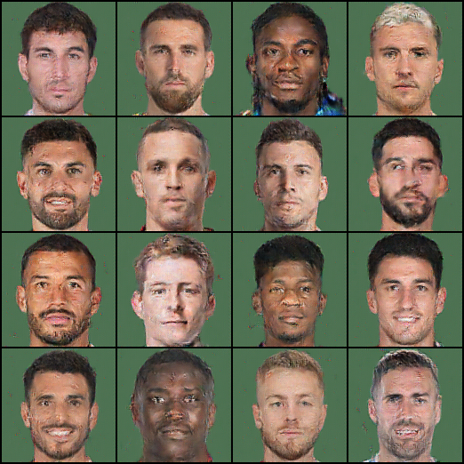

# ⚽ Footballer FaceGAN

A compute-efficient **InfoGAN + DiffAugment** implementation for generating realistic **footballer face portraits** from the **FM23 Cutout Facepack dataset**.  
Built with **PyTorch**, integrated with **Gradio** for interactive latent-space exploration, and accompanied by a **fully reproducible research report**.

---

## 🧠 Project Overview

**Goal:**  
Train a lightweight GAN capable of learning facial attributes (lighting, complexion, face shape, hair color) from a small custom dataset of footballer faces.  
The model should run efficiently on mid-range GPUs (e.g., RTX 4060) while maintaining stable convergence and interpretable latent variables.

**Key Objectives:**
1. Implement a **DCGAN + InfoGAN hybrid** for attribute-controllable face synthesis.  
2. Use **DiffAugment** and **Spectral Normalization** for small-data stability.  
3. Visualize learned features through **latent-space traversal** and **PCA analysis**.  
4. Deploy an **interactive Gradio demo** for image generation and feature sliders.  
5. Generate a **replicable report** with experiments, metrics, and qualitative results.

---

## 🔥 Latest results

Here are the most recent generated samples from the model (small faces grid from the training run). The image below demonstrates the current best qualitative output.

<!-- Inline image: works with GitHub markdown and in previews. Keep both HTML and Markdown fallback. -->
<p align="center">
	
</p>

<!-- Fallback for some renderers: explicit link to the raw file hosted on GitHub -->
[Latest generated samples](https://raw.githubusercontent.com/Gedmski/footballer-gan/main/outputs/figs/latest_results.png)

---


## 🏗️ Architecture

| Component | Description |
|------------|-------------|
| **Generator (G)** | DCGAN-style convolutional generator with latent vector `z ∈ R⁶⁴` and InfoGAN latent codes `c_cat`, `c_cont`. |
| **Discriminator (D)** | Spectral-normalized CNN with auxiliary head `Q` to predict latent codes for MI loss. |
| **Loss Functions** | Non-saturating GAN loss + Mutual Information (InfoGAN) + optional R1 regularization. |
| **Data Augmentation** | DiffAugment (color jitter, translation, cutout). |
| **Optimizers** | Adam (TTUR): G lr = 2e-4, D lr = 1e-4, betas = (0.0, 0.9). |
| **Stabilizers** | EMA on Generator weights, AMP mixed-precision, SpectralNorm. |

---

## 🧩 Folder Structure

```

footballer-gan/
├─ data/
│  ├─ raw/               # Original FM facepack images
│  ├─ processed/         # Cropped, 128×128, RGB-only faces
├─ configs/
│  ├─ dcgan_infogan_128.yaml
├─ src/
│  ├─ datasets/
│  │  └─ fm_cutout.py
│  ├─ models/
│  │  ├─ generator.py
│  │  ├─ discriminator.py
│  │  └─ q_head.py
│  ├─ losses/
│  │  ├─ gan_losses.py
│  │  └─ infogan.py
│  ├─ augment/
│  │  └─ diffaugment.py
│  ├─ train.py
│  ├─ eval_fid_kid.py
│  ├─ viz/
│  │  └─ latent_pca.py
│  ├─ app/
│  │  └─ gradio_app.py
├─ reports/
│  ├─ paper.md
│  ├─ figs/
├─ requirements.txt
└─ README.md

````

---

## ⚙️ Environment Setup

```bash
# 1. Clone repository
git clone https://github.com/<your-username>/footballer-gan.git
cd footballer-gan

# 2. Create virtual environment
python -m venv .venv
source .venv/bin/activate  # or .venv\Scripts\activate on Windows

# 3. Install dependencies
pip install -r requirements.txt
````

---

## 🧰 Training

```bash
python src/train.py --config configs/dcgan_infogan_128.yaml
```

**Arguments**

| Flag       | Description              | Default                          |
| ---------- | ------------------------ | -------------------------------- |
| `--config` | Path to YAML config file | `configs/dcgan_infogan_128.yaml` |
| `--resume` | Resume from checkpoint   | `None`                           |
| `--device` | Device to use            | `cuda`                           |

---

## 🎨 Gradio Latent Explorer

Run the interactive demo:

```bash
python src/app/gradio_app.py
```

**Features:**

* `c_cont[0–3]` sliders for continuous latent controls (e.g., lighting, hue, shape)
* PCA sliders (`PC1–PC3`) for unsupervised latent traversal
* Truncation ψ adjustment
* Category dropdown for `c_cat` cluster selection
* Random seed, interpolation, and export options

---

## 📊 Evaluation Metrics

| Metric  | Purpose                            | Library          |
| ------- | ---------------------------------- | ---------------- |
| **FID** | Image realism & diversity          | `torch-fidelity` |
| **KID** | Small-data unbiased realism metric | `torch-fidelity` |
| **MOS** | Subjective human rating of quality | manual           |

**Example:**

```bash
python src/eval_fid_kid.py --real ./data/processed --fake ./outputs/samples
```

Target benchmarks for 128×128 faces:

* **KID < 0.05** (good)
* **FID < 30** (solid for small dataset)

---

## 🧾 Research Report (reports/paper.md)

**Sections**

1. Introduction & Motivation
2. Related Work (DCGAN, InfoGAN, DiffAugment)
3. Dataset & Preprocessing
4. Architecture & Loss Functions
5. Training Details & Stability Tricks
6. Quantitative Results (FID/KID)
7. Latent Space Analysis (InfoGAN codes, PCA)
8. Gradio Demonstration
9. Limitations & Future Work
10. Reproducibility (environment, seed, configs)

---

## 🔍 Latent Analysis

* Visualize **PCA-projected latent axes** (`latent_pca.py`)
* Sweep InfoGAN continuous codes for attribute interpolation
* Compare baseline (no InfoGAN) vs InfoGAN variant

---

## 🧮 Future Improvements

* Add weak attribute conditioning (hair color, beard, skin tone)
* Progressive growing for 256×256 resolution
* Integrate StyleGAN2-lite architecture
* Combine with a pretrained face encoder for identity control

---

## 🖥️ Tools & Extensions

| Category      | Recommended VS Code Extensions                              |
| ------------- | ----------------------------------------------------------- |
| Core          | `Python`, `Pylance`, `Jupyter`, `Black Formatter`, `isort`  |
| AI/Docs       | `GitHub Copilot`, `Copilot Chat`, `Markdown All in One`     |
| Productivity  | `GitLens`, `Error Lens`, `Todo Tree`, `Material Icon Theme` |
| Visualization | `Mermaid Markdown`, `Draw.io Integration`                   |

---

## 🤝 Contributions

Pull requests and improvements are welcome.
If you train on a different dataset (e.g., anime faces, stylized portraits), open an issue with results and configs!

---

## 🪪 License

MIT License © 2025 Gabriel Marquez
You may use this code for academic, educational, and non-commercial research purposes.

---

## 🏁 Acknowledgments

* *Radford et al., 2015* – DCGAN
* *Chen et al., 2016* – InfoGAN
* *Zhao et al., 2020* – DiffAugment
* *Seitzer, 2020* – torch-fidelity metrics
* FM23 Cutout Facepack community dataset

---

> *“Football teaches structure, but creativity thrives in the open field. This project aims to blend both.”*